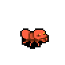
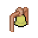
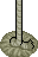

# Cheddar and Feta


## Introduction

Cheddar and Feta is a 2D RPG and corresponding engine built using [SDL3](https://libsdl.org/) for cross-platform windowing and graphics, and [libdatachannel](https://libdatachannel.org) for WebRTC connectivity.

## Building

To build Cheddar and Feta, ensure that you have CMake installed. With CMake, you can build Cheddar and Feta from Linux, macOS, or Windows using the following commands.

Clone the repository, recursing submodules (SDL3, libdatachannel):

```
git clone https://github.com/micahdbak/cheddar-and-feta --recurse-submodules
```

Enter the cloned repository, configure, and build using CMake:

```
cd cheddar-and-feta
cmake -S . -B build -DCMAKE_BUILD_TYPE=Release
cmake --build build --config Release
```

Copy the necessary assets:

**Linux/macOS:**

```
./copy_assets.sh
```

**Windows:**

```
./copy_assets.ps1
```

The `CheddarLauncher`, `FetaLauncher`, and `MapEditor` executables should now exist in `build/Release`. Open them from the command line to play as Cheddar, play as Feta, or edit the map files.

## Game Description

### Two Mice, One Mission

Play as Cheddar and Feta, two brave mice trapped deep within a militarized fire ant colony. Work together with a friend online or locally. If one mouse falls, the other has just moments to stay alive! If both mice are downed, then it's game over.

### Online Co-op Adventure

Connect with a friend over the internet using peer-to-peer WebRTC technology. Share your connection code and embark on this adventure together, no matter the distance!

### Kick, Throw, Survive


Armed with nothing but their tiny paws, Cheddar and Feta can kick enemies to fend them off. But to truly thrive, you'll need to scavenge powerful items scattered throughout the tunnels: toothpicks to throw as deadly javelins, molotov cocktails to set the ants ablaze, and protective shields to reduce incoming damage.

### Cheese is Life


Discover precious cheese wedges dropped by fallen foes. Eat cheese to heal your wounds.

### Face the Swarm



Battle through an ever-dangerous horde of fire ants, fierce drones swooping from above, rumbling tanks, and toothpick-shooting agents. And finally, defeat the dreaded Queen: a fearsome multi-segmented bug that blocks your way to the surface.

### Ring the Bell, Open the Gate



Strike mysterious bells hidden in the ant hill to clear the waves of enemies guarding locked gates. Only when the last foe falls will the path forward open!

### Climb to Freedom



Ascend toward the light using ladders scattered throughout the ant hill. Navigate multiple interconnected levels as you find your way to the surface!